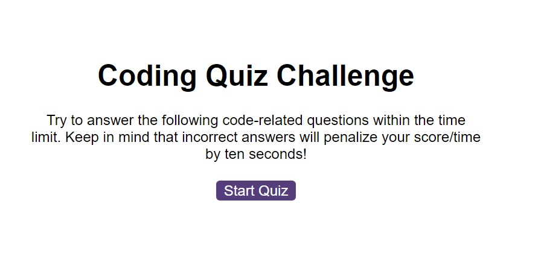

# the-coding-quiz

An interactive quiz website

# Console-Finances

Analysing financial records

## Description

This project contains a quiz, with the following features:

- A start button that when clicked a timer starts and the first question appears
- The question is displayed and four buttons underneath for each answer.
- When answer is clicked, the user gets notified if it right or wrong, a sound is played (depending on the right/wrong answer), and then the next question is displayed.
- If the answer was incorrect, 10 seconds is taken off the time
- The quiz ends when all the questions are answered or when the timer reaches 0.
- At the end, the end screen is displayed, where the user's time is displayed as a score.
- The user is given the option to enter their initials are save their score, as a highscore.
- The highscores will be kept for further attempts of the quiz.
- The user can also clear the highscore, if desired.

- In order to create this, I used DOM manipulation to add, remove classes to elements, create elements.
- I have attached eventListeners to the desired buttons, and added the relevant functions.
- I used a series of for loops to display the next question and to validate each answer.
- A set interval was used for the time, that displays a new number every second, counting down.
- A timeout is used to pause, when each answer is clicked, to give enough time for the correct/wrong answer to be displayed to the user.
- The time is recorded, and sent to localStorage to be presented on the highscores page.

## Usage

To use the quiz, click on the start button. The first question will appear. Click on a button, and it will display right or wrong. Keep an eye on the timer, as it takes 10 seconds away for each wrong answer. At the end, enter initials, to save a score to the highscore page.

## Screenshot

## The website

This site can be found at https://liamjameswatson.github.io/the-coding-quiz/

## License

MIT License (Please refer to [LICENSE](/LICENSE) in the repo.)
